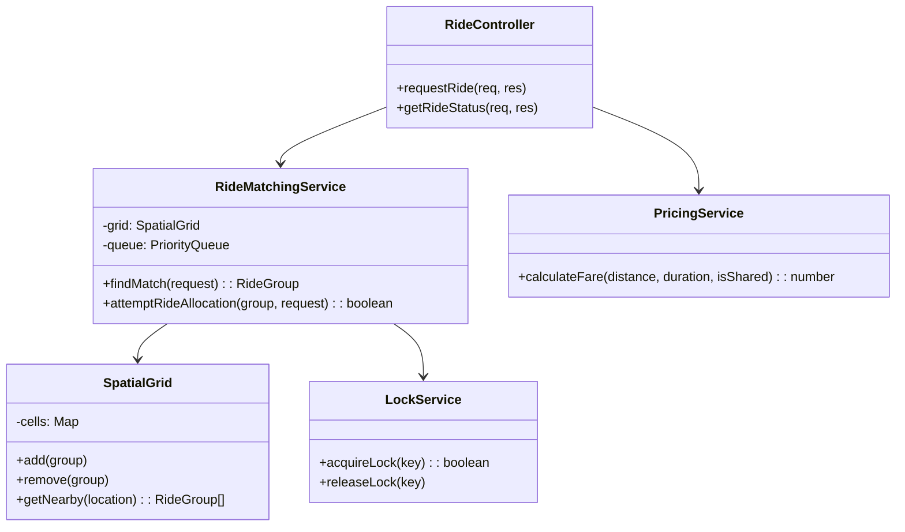

# System Architecture

## High-Level Design (HLD)

The system follows an event-driven, worker-based architecture to decouple request ingestion from heavy processing.

```mermaid
graph LR
    User[User / Client] -->|HTTP POST| LB[Load Balancer / API Gateway]
    LB --> API[Express API Server]
    
    subgraph "Synchronous Layer"
        API -->|Validate & Rate Limit| Middleware
        Middleware -->|Enqueue Job| Queue[Redis Queue (BullMQ)]
        API -->|202 Accepted| User
    end

    subgraph "Asynchronous Layer"
        Queue -->|Process Job| Worker[Worker Service]
        Worker -->|Find Match| Matcher[Matching Engine]
        matcher -->|Lock| Redis[Redis (Locks/Cache)]
        Matcher -->|Persist| DB[(PostgreSQL)]
    end
```

## Low-Level Design (LLD)

### Class Structure

The core logic revolves around the `RideMatchingService`, which utilizes a `SpatialGrid` for efficient lookups and a `PriorityQueue` for optimizing matches.



## Data Flow
1.  **Ingestion**: Client sends request -> Controller validates -> Pushes to Redis Queue.
2.  **Processing**: Worker picks up job -> Reconstructs `RideRequest` object.
3.  **Matching**:
    *   Compute Grid Key used `SpatialGrid`.
    *   Retrieve nearby `RideGroup` candidates.
    *   Filter by **Capacity** (seats available?) and **Constraints** (detour < tolerance?).
4.  **Optimization**: Use `PriorityQueue` (Min-Heap) to pick the ride with minimum detour/cost increase.
5.  **Concurrency**: Acquire **Redis Lock** on the chosen RideGroup ID.
    *   If locked: Retry or pick next best.
    *   If success: Add passenger, update route, release lock.
6.  **Persistence**: Update RideGroup state in Database.
